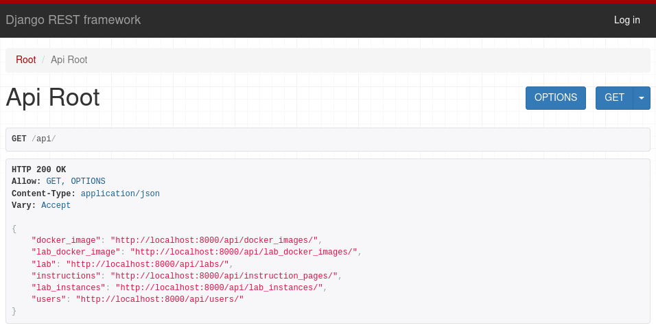
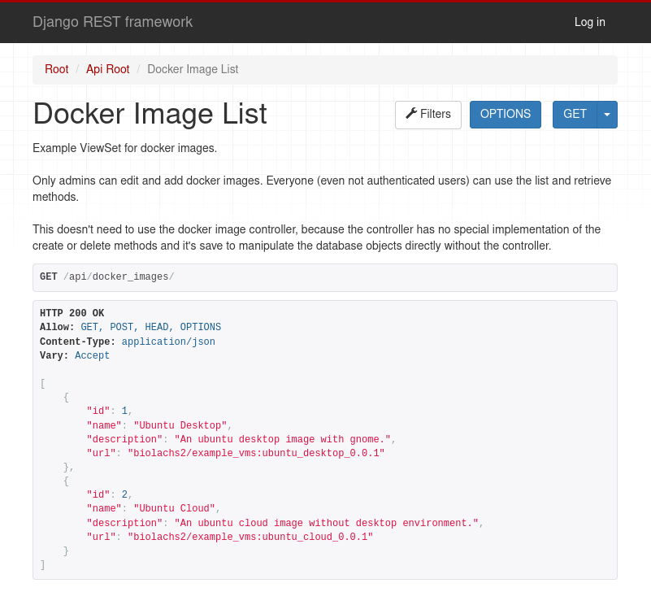
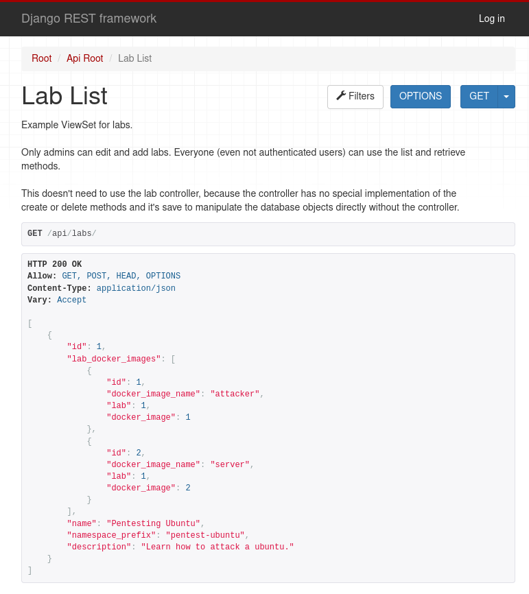
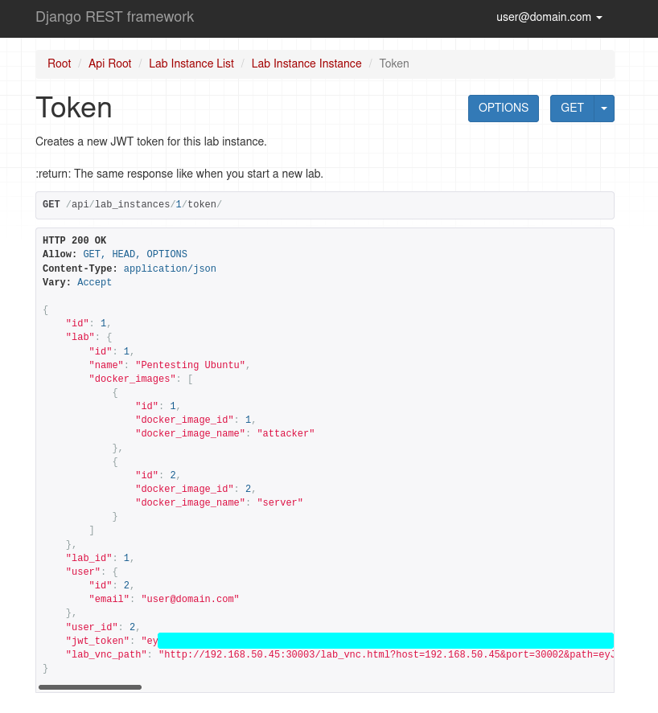
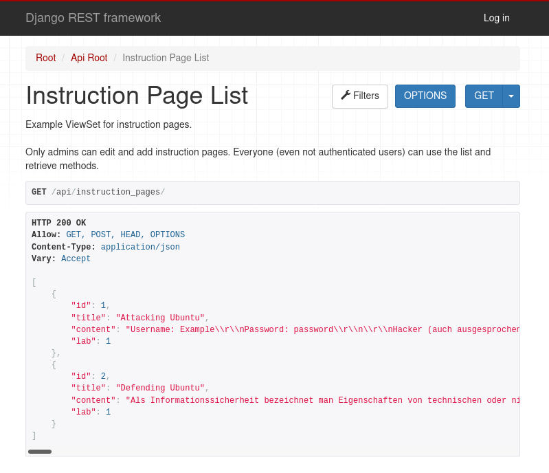
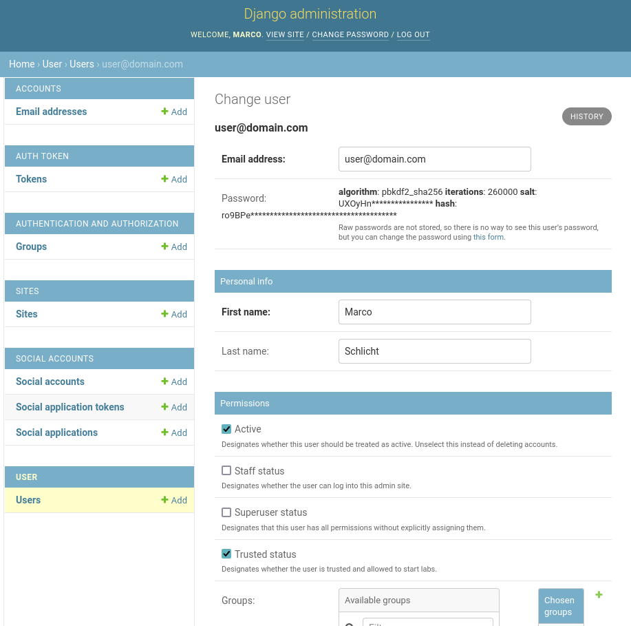
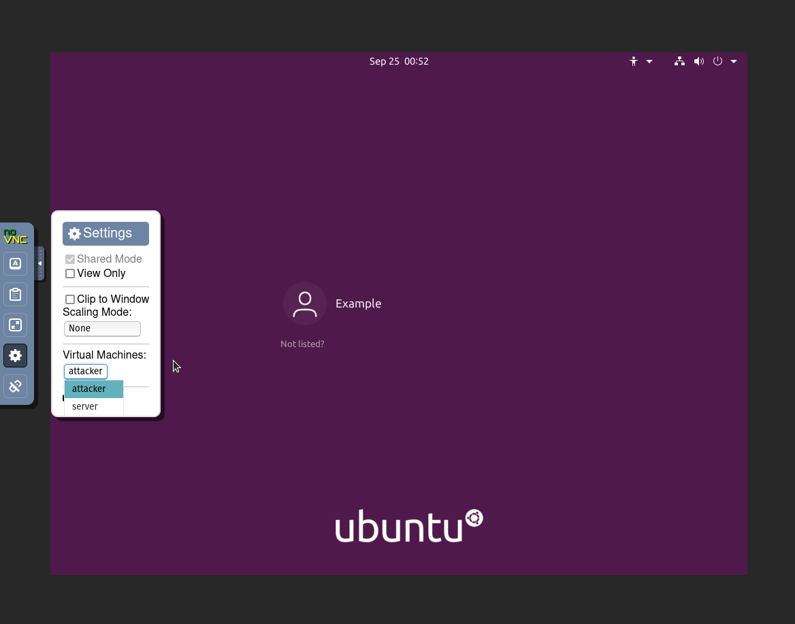
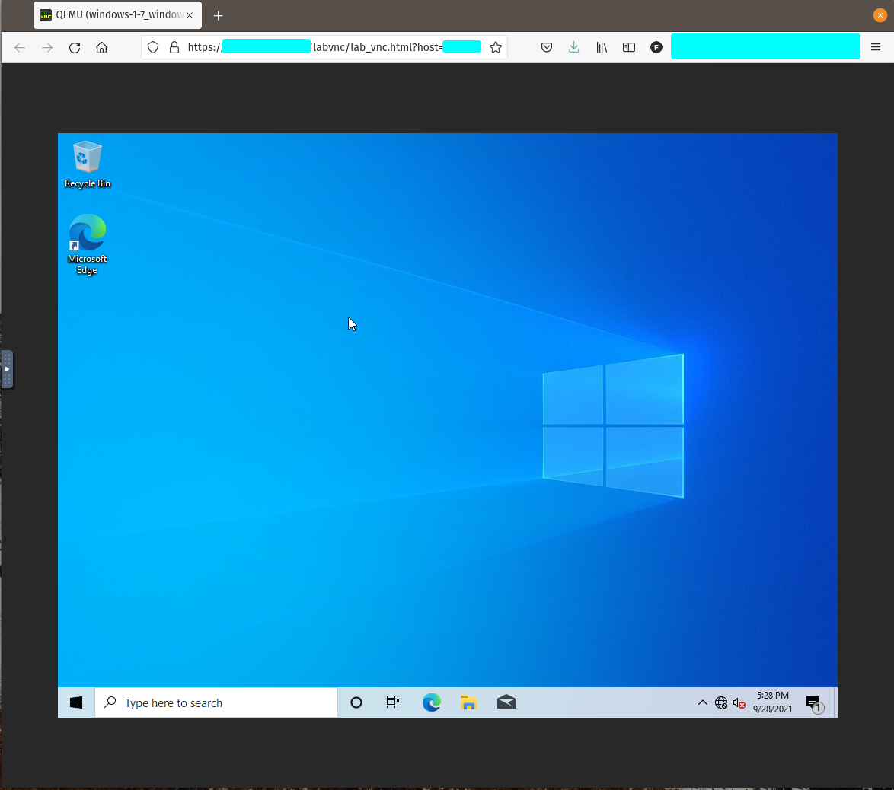

# Workplan

**June:**

One month bevor the start of the project I have started to learn some basics about Kubernetes and documented this in the LabOrchestrator-Documentation project.

This part also includes research about a documentation tool called pandoc. With pandoc and some plugins I was able to write a documentation in markdown and convert it into a nice looking pdf.

The research about Kubernetes includes control planes, custom resources and the following basic Kubernetes objects: pods, deployments, services, ingresses, ingress controllers, namespaces, network policies, config maps and secrets. Most of them are used in the final project. After that I learned about the tools kubectl, kind and minikube which are needed to deploy a Kubernetes cluster and configure it. Some of this knowledge is written down in the installation part of the documentation. I took a quick look at helm, krew, KubeVirt, virtctl and rancher aferwards.

KubeVirt looked like it could solve a big part of the project so the next step involves learning how KubeVirt works and how I can use it. With KubeVirt its possible to deploy VMs in Kubernetes. I've made a small documentation about the KubeVirt custom resources virtual machines, disks, volumes, interfaces, networks, services and network policies. The result of this step was a yaml configuration file with that I was able to launch a VM in Kubernetes.

**July first two weeks:**

In this two weeks I have started looking at how to build and launch custom images. This started with making a dockerfile, container disk and uploading the docker image to docker hub. This was just an ubuntu cloud image with cloud-init and without custom changes. After the deployment I've connected to the VM and it was very slow and it figured out that it was insufficient memory. This problem was hard to find because my system had enough free memory but Minikube doesn't use all memory of the system. The solution was to increase the memory. This is done with the `--memory=` parameter. In the same step I also increased the disk size and the amount of CPUs minikube is allowed to use.

After that I have added a guide on how to build custom images. There are two ways of doing this. The easy one is opening the ubuntu image in gnome boxes, making changes there and then using the saved qcow2 image that gnome boxes generates automatically. The other way starts with resizing the image and then using cloud init to install software and set passwords.

Then I took a look at ttyd which is a tool that can be used to access the terminal from a browser. I found two ways on how to use this. The first is installing ttyd inside of a VM and the second is to use ttyd outside with the `virt console` command. None of them are used in the final version, but they can still be integrated.

Next I took a look at noVNC which is a tool that can be used to open the VNC connection in a browser. This tool is used in the final version for VNC to desktops and terminals. During this step I came across virtvnc which is a tool that runs noVNC in Kubernetes and enables the user to open any VM. It uses the KubeVirt API to get the VNC websockets.

**July second two weeks:**

Now I was able to deploy custom VMs and found some possible ways of getting terminal or VNC access in the browser. In the next step I took a deeper look at how to directly access the Kubernetes API. Then I connected noVNC to this API and was able to access VM VNC websockets through the API with a selfhosted instance of noVNC.

The next step includes finding a way to separate the labs. For this I took a deeper look at network policies and namespaces. With network policies it's possible to separate the connections between namespaces. Thus a lab corresponds to a namespace. During this research I found a bug in the documentation of KubeVirt and fixed it with a pull request in github.

One problem that occurred here is that Kubernetes doesn't have a default network controller that implements network policies. The solution was to install the network controller calico.

In the end of this month the proof of concept was ready. I'm able to deploy VMs and access them in noVNC through the API and the separation of labs works too. A solution for accessing the terminal was also found. The only part missing is using docker containers instead of VMs, but that isn't so important because everything can be done with VMs and it can easily be added later.

**August first two weeks:**

In this month I started to work on a prototype using Flask. The prototype should be a first implementation of the lab orchestrator and show bigger problems early.

The work on the prototype was divided into 3 parts: Deploying an API to the cluster, using the Kubernetes API and User Support.

Step one contains a hello world API which is packaged into docker. Then I created a deployment and a service in Kubernetes that deploys it.

For step two "using the Kubernetes API" I needed to create a service account with RBAC authorization. After that I was able to list, create and delete VMIs with the prototype. To connect to the VNC websockets through the API I created a websocket proxy. This is needed to add authentication so you only get access to VMs you are allowed to access. A problem in this part was that you can't send authorization information with noVNC. The solution ist that the websocket proxy reads a token from the path you specify and checks if the authorized user has the rights to access the VNC websocket of this VM. This method was necessary to be able to transfer the authorization data via noVNC.

Part three the user support started with a refactoring of the previous code. The result was an api class with which you can easily use the api and which is easily extendable with further api methods. Details about this refactoring are contained in the documentation.
The next part in this step was building a yaml parser that is able to replace variables. This is used for the templates that were used in the API to create resources. It works that way that a template (for example namespace) is loaded and then the needed variables can be injected into that template. After that, the yaml is sent to the API.
After that SQLAlchemy is used to connect models to a database. With that it's possible to save "DockerImages" which are links to docker hub images that contain the VMs, and it's possible to create and save labs that can be started.
Last in this part I've added the user support. You can create new users and get tokens for a user with that you can access the API.

In the end of this two weeks I had a prototype that implements the basic methods and shows that the lab orchestrator is possible.

**August second two weeks:**

During this step I started refactoring with splitting up the prototype into libraries and microservices. One core idea during this step is to abstract most parts of the microservices into libraries. This has the advantage, that they can be used in other projects as well. For example if you don't need the lab orchestrator and only a websocket proxy, you can use the websocket proxy lib. Or if you want to replace the API with a desktop frontend, you can use the lab orchestrator library without the django API.

One part of the plan was to separate the core of the lab orchestrator into an independent library called LabOrchestratorLib and implementing the API in a different project (LabOrchestrator-Api) that only has to use the library. During the two weeks I only created a repository for the API and not implemented it. I started working on the library but more on the results here later.

Another part is the WebsocketProxy which should run as an independent microservice. This part is also splitted into a library that implements all logic and a wrapper project that runs this library. The library can be used in other projects as well and the wrapper part is packaged into docker and can be run independently from the LabOrchestrator-API. During the two weeks I only created a repository for this two parts but not implemented them.

The disconnection of the library from the api caused the problem that I needed to decide if and which database to use in the library. My first idea was to just use a sqlite database in the library. This has the advantage, that it would be very easy to use and implement the library. But deploying multiple instances or using other databases wouldn't work then. The database should be in the control of the system administrator that is responsible for deploying the application and this idea would remove the control over the database. The next idea was to just return objects and don't save any. This had not worked, because I also needed to find objects in some parts of the library. The final idea was to use adapter interfaces. An adapter interface defines which methods the library needs to work and the developer who uses this library needs to implement these interfaces.

The idea results into an adapter interface for every database model that is needed in the library and two new libraries called LabOrchestratorLib-DjangoAdapter which implements the interfaces for using the library in django projects and another one called LabOrchestratorLib-FlaskSQLAlchemyAdapter which could be used in a flask project. The second library is now deprecated and was only used to find out how abstract the interfaces have to be defined to implement them in different ORMs. The django adapter was implemented in the two weeks and contains an example API.

After finding a solution for the database and while implementing the Django and Flask adapters I worked on the lab orchestrator library. I copied the Kubernetes API, the template engine and added unit tests for both of them. After that I added a database model that can be used with the adapters, then the adapters and last I added controllers. The controllers are used to control resources. For example a lab controller controls the resource lab. It takes a lab adapter and then uses the adapter to provide functions for adding, deleting and updating labs. Then a controller collection was added. The controller collection takes all adapters that needs to be implemented and returns a collection of all controllers. This collection gives the user of the library a central point to control and use all features and resources.

Another part that is split into its own library is the JWT authentication part. Because this is used in the websocket proxy lib and the lab orchestrator lib I decided to split it up into a common library. This library contains a method to decode, encode and verify a JWT token. The problem was that the websocket proxy needs to get information about the lab (for example the namespace where it is running) to perform the correct routing. The first idea was to just call the lab orchestrator api from the websocket and get the information with a http call. This would increase the complexity of the application and create a dependency from the websocket to the lab orchestrator api. Another solution the one that I preferred is to use JWT tokens. JWT tokens contains signed data that can be encrypted by everyone. To verify the signature you need to know a key. Currently I use symmetric keys, but I plan to change it to asymmetric ones in the future to be able to verify it in the frontend. This JWT token is used to transfer data to the websocket proxy without the need of a dependency to the API. A disadvantage of this library is that changes would affect virtually all libraries and lead to a rebuild of them.

**September first two weeks:**

During this weeks I implemented the WebsocketProxy and WebsocketProxyLib. The WebsocketProxy is packaged into docker and released in docker hub. The library is released in pypi.

After that I worked on the lab orchestrator lib, the auth project and the django adapter. Previously a token was only valid for one VM and I changed that the token data contains multiple VM names that are allowed. With this change it's possible to use one token for all VMs in a lab. I've also added some more data to the token that is needed by the WebsocketProxy.

These token changes were also implemented in the lab orchestrator library. After that I've added unit tests for the controllers, some more tests for the Kubernetes API and minor other changes.

**September second two weeks:**

In the final two weeks much stuff happend. I've created a logo, a banner and a lot of documentation. The documentation consists of two parts: a developer documentation for people who work on the projects and user documentations. The user documentations in the libraries is a description for other developers who uses these libraries and the user documentation for the API and websocket proxy are made for admins who host the software. The documentation for the libraries can be found on read the docs and the documentation for the API and websocket proxy can be found on github and in the large project documentation pdf.

There is also a summary of all projects in the LabOrchestrator project. This project contains a short description of all projects and libraries and it also contains Kubernetes files to deploy the full application with all parts at once.

A big part in this weeks was to create LabVNC. LabVNC adds some parts to noVNC with that it is possible to switch between the VMs in a lab.

Changes on the auth library are mostly code documentation and user documentation. I've also added an example test case but not implemented it right now.

Same applies to the websocket proxy and the websocket proxy lib. One additional change that is made here is that the websocket proxy lib now can handle URL prefixes. During hosting the application in an production environment I've added a nginx proxy that routes all requests to the API except those who start with `/ws_proxy` or `/labvnc`. Requests containing those prefixes are routed to the websocket proxy or LabVNC. That results to the problem, that the path that is parsed in the websocket proxy contains a prefix which needs to be removed to read the token. The change fixes this problem.

Most of the changes on the lab orchestrator lib are also documentation. Furthermore I've changed details in the adapters, for example I removed an unnecessary `get_by_attr` method and changed the filter method that it returns a list instead of a single item. This was necessary to get a list of lab instances that belongs to a user, which may be used quite often. I've added another new features to the lib. Before that a lab could only contain one VM, now you can add as many VMs as you like. Otherwise there were still some bug fixes.

The second big part was the implementation of the API. This project is written in django-rest-framework and uses viewsets. It implements a REST-API and has a build-in permission system, admin page and user management. Nonetheless I've changed the user model, replaced the username with an email address and added a display name. The displayed name is generated from the first and last name and can be overwritten with a custom name for privacy reasons. I've added some methods to the permission system to check if a user is trusted. This is because only trusted users are allowed to start VMs to prevent DOS attacks. There is a module called common that contains methods that can be reused in multiple apps.

The first step in this API was to create a settings file and copy the example viewsets from the lab orchestrator django adapter with minor changes. The settings will get all configuration of the API from environment variables. Also I've added the django rest framework filter backend, which is used to add filters. For example you can attach `?lab_id=1` to the instruction page API and you will only get the instruction pages that are referenced to the lab with id 1. One change in the copied views is the token method. When you create a lab instance you will get a token to authenticate in the VNC websocket. This token expires after some minutes. I've added a method to refresh the token at `/api/lab_instances/<lab_instance_id>/token/`. Also the response during the creation of a new lab instance and the token refresh contains an URL that points to the noVNC with the correct configuration of URL parameters to be able to connect to the VMs. So when you start a lab you will get the link to access the VMs.

Another big part of the library was the integration of django-rest-auth and allauth. django-rest-auth adds a rest api that contains methods for user management for example registration and password change or password reset. It automatically implements sending verification e-mails. allauth is a dependency of django-rest-auth and theoretically adds support for OAuth and social login. It can be used for example to login to the project using github oder gitlab. I have not tested it in this project but it may work.

After that I've added added tests for the user pages and the rest auth api, because they are the most important parts.

One feature I have added to the REST-API is the instruction page. This feature was planned to be added in the lab orchestrator lib in the beginning, but I decided to keep the library clean and just let it take care of the lab orchestration. If you only want to use the orchestrator you don't need instructions. And implementing the instructions can be easily done in addition. The effort to add the instructions to the library would be too high compared to the current solution, thanks to the adapters. Instruction pages are currently only a title with a text that is connected to a lab. A lab can have multiple instruction pages. The preview of the instruction page is part of the frontend and not library and therefore not part of this work.

I had many problems with migrations and docker shipping. During the development I'm using venvs which is a local folder with all python dependencies. The lab orchestrator lab django adapter and the allauth libraries where installed in this folder. With django it's possible to auto generate database migrations. One time, I don't know why, a migration was made in the venv folder in the django adapter project and another migration was created in the instruction page app that depends on that migration. Because the venv folder is not shipped with docker a migration was missing in the deployment and it crashed. It was hard to find out that this problem occurred due to a wrong generated migration, but the solution was to purge the venv and create a new one. Then the migration wasn't made. I'm not sure why this solved the problem, but I think somehow I changed something in the django adapter in the venv folder. This can happen because my IDE is able to step into the code in libraries. The next problem with migrations was related to allauth. In my project settings I've set the `DEFAULT_AUTO_FIELD` variable to `BigAutoField`. This is used for default primary keys in database models. Then a migration was created for the allauth library again in the venv folder to switch from `AutoField` to `BigAutoField`. This migration was not shipped again and resulted into a crash. The problem did not occur locally and was only noticed after I deployed the application in production a version later. During this bug, the deployment created missing migrations itself and thats why the problem doesn't occurred directly but a version later when the container is removed and the migration was missing in the container but already done in the database. Because of this it was hard to figure out which change leads to this problem. Long story short: set `DEFAULT_AUTO_FIELD` to `AutoField` prevents the creation of this migration.

Last but not least I've added a swagger ui and openapi-schema.

Finally I've created the LabOrchestrator project. As already noticed this project contains a short documentation of all subprojects and libraries and the deployment files for deploying the LabOrchestrator in Kubernetes. The README contains a banner and different labels for every subproject which briefly shows you the most important information about the project for example the latest released version and the project license. There was only one problem, I missed adding the correct RBAC rules to the API deployment. During development I've used the kubectl proxy and there is no permissions needed. The bug caused that it was not possible to create namespaces in production which in turn caused that no VMs could be created. The solution was to add the correct RBAC rules.

# Milestones

**Abstract:**
The work on the project was divided into four phases. First, the acquiring of knowledge with a proof of concept. In this phase, the basics about Docker, Kubernetes and KubeVirt were worked out which is necessary to carry out this project. Then, a proof of concept was used to show that the Lab Orchestrator idea is possible with these technologies. In the second phase a prototype was created, which reproduces the concepts of the proof of concept in a program in order to identify possible problems and solve them at an early stage. Phase 3 and 4 are respectively an alpha and beta phase of the project, in which the actual project is carried out. Here a library and an API are developed.

**Documentation:**
A documentation was prepared for the first two phases. It contains almost all the results that have emerged during the work on the first two phases. The documentation starts with an introduction that explains the goals of this project and the individual phases. After that, the chapter Basics explains some basics of Kubernetes and other tools. This chapter will be extended with Docker basics in the future when a possibility to use Docker containers instead of virtual machines will be added. After that there is a chapter that shows how to set up the development environment and the production environment. This is followed by chapter 4 "Proof of Concept" and chapter 5 "Prototype". In the "Proof of Concept" chapter, a subchapter on Docker will also be added in the future. The documentation is available under MIT license and can be found here: [github.com/LabOrchestrator/LabOrchestrator-Documentation](https://github.com/LabOrchestrator/LabOrchestrator-Documentation)^[https://github.com/LabOrchestrator/LabOrchestrator-Documentation].

**Phase 1, Research:**
The first goal of phase 1 was to acquire the necessary knowledge. Basic knowledge of Docker was already available, so the main focus was on Kubernetes. A special focus was on the Kubernetes extension KubeVirt, which allows to start VMs in Kubernetes. In addition, ttyd was looked at, a tool with which a terminal in a VM or a container can be accessed in the browser, and noVNC, a tool with which VNC of a VM or a container can be accessed in the browser. noVNC, unlike other VNC programs, requires a websocket instead of a TCP socket. Practically, KubeVirt provides a websocket to the VNC of the VMs out of the box.

The goals in the second step of phase 1 were to provide a VM and a Docker image in Kubernetes via the terminal and VNC on the web. Several VMs should be able to be started in a lab and be accessible to each other, but access to VMs in other labs should not be possible. The combination of KubeVirt, ttyd and noVNC was used in the proof of concept to fulfill the first goal. Kubernetes network policies was then used to achieve the separation of the labs.

The basic goals of knowledge acquisition and proof of concept were met in this phase. Several VMs per lab and several labs were started here and it was possible to connect to them via ttyd and noVNC. The labs could not be reached among each other. What is missing are the Docker containers. It was not looked at how the whole thing can be achieved with Docker containers but only via VMs with KubeVirt. However, since VMs are functionally sufficient, this was the focus.

**Phase 2, Prototype:**
The goal in phase 2 was to program a prototype that uses the concepts from phase 1 and makes them available in an API. A Docker container should be created, which deploys this app in Kubernetes. In the end, this API should be accessible via Kubernetes, allow the creation of labs and VMs, access to them via ttyd and noVNC, and add a layer for user authentication. Deployment in the cluster was done via Docker in step 1. The lab orchestrator accesses the Kubernetes API within Kubernetes. For this, a service account with appropriate RBAC rules was used in the second step and the Kubernetes API was looked at. In the third step, functionality was added in the app to get VMIs via the API, start new VMIs and add authorization to the VNC access. Flask was used for the API here. The VNC access does not have authorization by default and in order to apply our user management to it we had to develop a websocket proxy, which was then integrated into the app. The websocket proxy reads a token from the path you specify and checks if the authorized user has the rights to access the VNC websocket of this VM. Afterwards in step 4 the prototype was refactored and user support was added.

The result is an API through which labs can be created, started and deleted. There is a simple user management system in which users can have different rights. Access to VNC is routed through the proxy and access is protected by JWT tokens. These two goals are thus achieved. One goal, namely the access to ttyd, was not implemented in the prototype, but is also not necessary, since one can access the terminal automatically via noVNC, if no desktop environment is installed.

**Phase 3, Lab Orchestrator Lib:**
The goal in phase 3 was to program a library that implements the core functionality of the project. The goal was to start and stop a lab, which is possible via the controllers. Thereby the users are linked to their labs which fulfills another goal. The goal to add and remove labs is also fulfilled and can either be done via the controllers or directly entered in the database. The two goals routing for labs with authentication are also fulfilled by the websocket proxy with JWT token authentication. The goals of adding instructions and linking to labs have been moved to phase 4 and fulfilled as it is more appropriate there. Authentication details for the VMs can be added in the instructions, as a result they are also part of phase 4. The optional goals to pause and resume labs were not fulfilled.

**Phase 4, Lab Orchestrator API:**
For phase 4, a REST API was implemented with django, which makes the functions of the library usable. Additional authorization via a user management and permission system was added here. The goal of the instruction from phase 3 was added here. With that one can store texts with a title and assign to a lab. The texts can be added by admins. Most of the instruction goals need to be implemented in a frontend, which was not part of this work. However, since these goals can be implemented with the current version of the API, I consider them fulfilled. This includes displaying pages with text and displaying knowledge texts. Any syntax can be used for this. The other optional goals of using Markdown or HTML syntax, displaying steps per page, and embedding images and other media can also be implemented through this and count as fulfilled. The must-have goal of having a controller to select VMs has been added in LabVNC. There you have to click on the settings on the left and you can select your VM. Interactions with VMs like copying text to the clipboard does not work. The optional goals variables, checkable steps and show a progress are not fulfilled.

## Project Results

Lab Orchestrator works and meets all functional goals. This means we have a working API, a working library and a solution for connecting with the VMs. Docker support is not necessary, but can still be added in the future. The projects are licensed under Mozilla Public License 2.0 or MIT License and can be found on [github.com/LabOrchestrator](https://github.com/labOrchestrator). The project [github.com/LabOrchestrator/LabOrchestrator](https://github.com/LabOrchestrator/LabOrchestrator) gives a short overview of all projects and links there repositories, documentation and packages.

VM base images accessible from the web are not needed, as any VM image can be used, which is even better. These need to be packaged into a Docker image and uploaded to docker hub. There are 3 examples of VMs at: [hub.docker.com/repository/docker/biolachs2/example_vms](https://hub.docker.com/repository/docker/biolachs2/example_vms). The goals in this part were all met except for Docker support for the same reason. However, other solutions were used here to implement the goals than originally planned.

The lab orchestrator lib fulfills all must-haves. This includes starting and stopping labs, adding and removing labs, routing, authentication and connect labs to users. The adapter pattern was used to store the data in a database. The objective of the instructions was moved to the web interface, but was also met.

The web interface offers all the functionalities of the library and adds user management and therefore also fulfills all the objectives.

Overall, all must-have goals were met. Instead of Docker containers, VMs were used and instead of ttyd, only noVNC was used. Nevertheless, all functions can be used. The optional goals were also partially achieved.

## Perspectives

What still needs to be done are some bug fixes and improvements to the api. Currently errors in the Kubernetes api are not caught there but ignored. Proper error handling can be added here. Also proper logging should be added.

We need to make a frontend that integrates the API, LabVNC and instructions. These frontend needs to implement the instruction goals. Also taking a look at why the clipboard in noVNC doesn't work would be good.

Some parts are missing the documentation right now for example the LabOrchestrator-DjangoAdapter and the developer documentation in the LabOrchestratorLib. This needs to be added. The most important parts have already have unittests but not all parts. This is also something I need to add in the future to improve the software quality.

Currently VMs aren't stopped automatically, so if someone forgets to stop its VM it will run forever. This should also be changed and hopefully can be combined with pausing a VM. Also resuming VMs may be helpful to improve the startup of VMs.

\pagebreak

## Appendix

**Workplan Goals:**

\textcolor{OliveGreen}{Yes}: Goal was achieved  
\textcolor{orange}{Partly}: Goal was achieved but differently than planned  
\textcolor{red}{No}: Goal was not achieved

| Workplan Goal                                   | Success                            |
|-------------------------------------------------|------------------------------------|
| Install Kubernetes and KubeVirt                 | \textcolor{OliveGreen}{Yes}        |
| Learn Kubernetes templates and base images      | \textcolor{OliveGreen}{Yes}        |
| Learn starting VMs in Kubernetes                | \textcolor{OliveGreen}{Yes}        |
| Evaluation web-terminal tools                   | \textcolor{OliveGreen}{Yes}        |
| Evaluation web-VNC tools                        | \textcolor{OliveGreen}{Yes}        |
| Docker base images with web-terminal tool       | \textcolor{orange}{Partly}         |
| VM base images with web-VNC tool                | \textcolor{orange}{Partly}         |
| Kubernetes template that runs base images       | \textcolor{orange}{Partly}         |
| Evaluation of routing solution                  | \textcolor{orange}{Partly}         |
| Routing with user support and authorisation     | \textcolor{orange}{Partly}         |
| Start and stop labs                             | \textcolor{OliveGreen}{Yes}        |
| Automatically configure routing                 | \textcolor{orange}{Partly}         |
| Add and remove labs                             | \textcolor{OliveGreen}{Yes}        |
| Add instructions                                | \textcolor{OliveGreen}{Yes}        |
| Add features of instructions                    | \textcolor{orange}{Partly}         |
| User and permission management in API           | \textcolor{OliveGreen}{Yes}        |
| Add all lib functionalities to API and database | \textcolor{OliveGreen}{Yes}        |

**Feature Goals:**

\textcolor{OliveGreen}{Yes}: Goal was achieved  
\textcolor{orange}{Partly}: Goal was achieved but differently than planned  
\textcolor{red}{No}: Goal was not achieved

| Workplan Goal                                  | Required | Success                           |
|------------------------------------------------|----------|-----------------------------------|
| Using Kubernetes with KubeVirt                 | No       | \textcolor{OliveGreen}{Yes}       |
| Support Linux and Windows VM images            | No       | \textcolor{OliveGreen}{Yes}       |
| Image with VNC and terminal access from browser| \textcolor{OliveGreen}{Yes} | \textcolor{OliveGreen}{Yes}       |
| Run images in a network                        | \textcolor{OliveGreen}{Yes} | \textcolor{OliveGreen}{Yes}       |
| Multiuser support                              | \textcolor{OliveGreen}{Yes} | \textcolor{orange}{Partly}        |
| Start and stop labs                            | \textcolor{OliveGreen}{Yes} | \textcolor{OliveGreen}{Yes}       |
| Pause and resume labs                          | No       | \textcolor{red}{No}               |
| Add and remove labs                            | \textcolor{OliveGreen}{Yes} | \textcolor{OliveGreen}{Yes}       |
| Configure routing                              | \textcolor{OliveGreen}{Yes} | \textcolor{orange}{Partly}        |
| Authentification in routing                    | \textcolor{OliveGreen}{Yes} | \textcolor{OliveGreen}{Yes}       |
| Show authentification details in labs          | \textcolor{OliveGreen}{Yes} | \textcolor{OliveGreen}{Yes}       |
| Connect users and their labs                   | \textcolor{OliveGreen}{Yes} | \textcolor{OliveGreen}{Yes}       |
| Add instructions                               | \textcolor{OliveGreen}{Yes} | \textcolor{OliveGreen}{Yes}       |
| Connect instructions and labs                  | \textcolor{OliveGreen}{Yes} | \textcolor{OliveGreen}{Yes}       |
| Instructions: Use markdown or HTML             | No       | \textcolor{orange}{Partly}        |
| Instructions: Pages with text                  | \textcolor{OliveGreen}{Yes} | \textcolor{OliveGreen}{Yes}       |
| Instructions: Controller to select VM          | \textcolor{OliveGreen}{Yes} | \textcolor{OliveGreen}{Yes}       |
| Instructions: Steps per page                   | No       | \textcolor{orange}{Partly}        |
| Instructions: Tick of steps                    | No       | \textcolor{red}{No}               |
| Instructions: Progress bar                     | No       | \textcolor{red}{No}               |
| Instructions: Include pictures and other media | No       | \textcolor{orange}{Partly}        |
| Instructions: Display knowledge texts          | \textcolor{OliveGreen}{Yes} | \textcolor{orange}{Partly}        |
| Instructions: Interact with VMs                | No       | \textcolor{red}{No}               |
| Instructions: Variables                        | No       | \textcolor{red}{No}               |
| User management                                | \textcolor{OliveGreen}{Yes} | \textcolor{OliveGreen}{Yes}               |
| API with all functionality of the library      | \textcolor{OliveGreen}{Yes} | \textcolor{OliveGreen}{Yes}               |

\pagebreak

**Logo and Banner:**

{ width=30% }

**API:**

{ width=95% }

{ width=95% }

{ width=95% }

{ width=95% }

{ width=95% }

\pagebreak

**Admin Page:**

{ width=85% }

\pagebreak

**LabVNC:**

{ width=85% }

{ width=85% }
